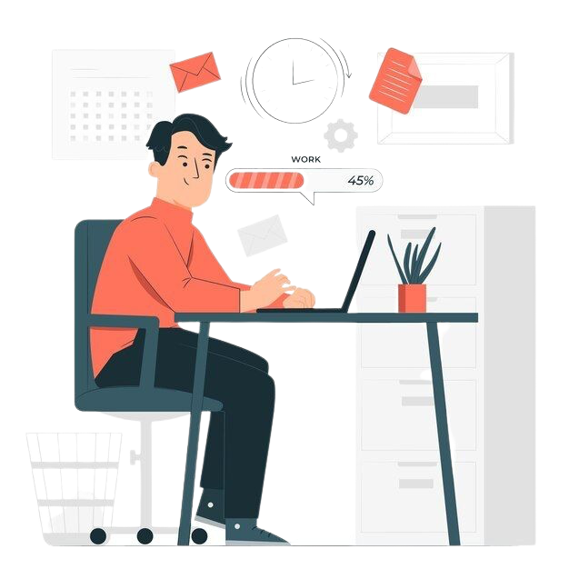

<html lang="en">
  <head>
    <meta charset="UTF-8" />
    <meta name="viewport" content="width=device-width, initial-scale=1.0" />
    <title>Work in Progress</title>
    <link rel="stylesheet" href="assets/css/style.css" />
  </head>
  <body>
    <!-- Logo Section -->
    <header class="header">
      <!-- <h1 class="logo">[Your Site Logo or Name]</h1> -->
    </header>
    <!-- Main Content -->
    <main class="content">
      <!-- Left Section - Under Construction -->
      <section class="construction-text">
        <h2>Under Construction</h2>
        

          We are currently working on this site to bring you relevant research
          insights. Please check back soon for updates!
        

      </section>
      <!-- Right Section - Infographic -->
      <section class="infographic">
        
      </section>
    </main>

  </body>
</html>
